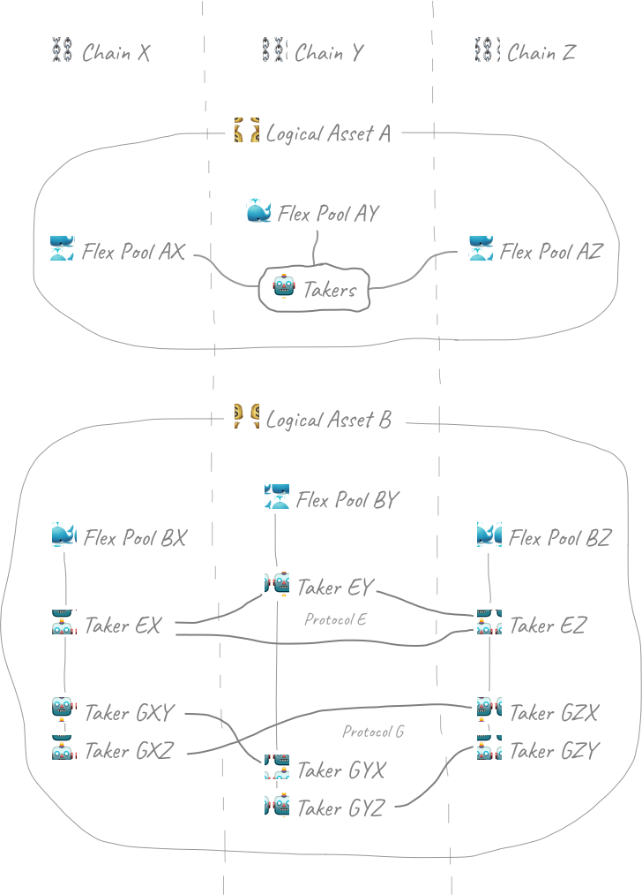
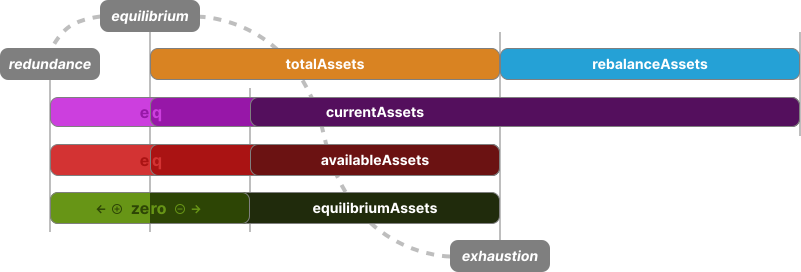

<!-- omit in toc -->
# Flex Pool Contracts 🐳

Smart contracts of Flex Pool protocol.

<!-- omit in toc -->
### Table of Contents

- [Description](#description)
  - [Overview](#overview)
  - [Infrastructure](#infrastructure)
  - [Operations](#operations)
    - [Deposit](#deposit)
    - [Withdraw](#withdraw)
    - [Take](#take)
    - [Give](#give)
    - [Rebalance](#rebalance)
  - [Asset](#asset)
    - [Total Assets](#total-assets)
    - [Current Assets](#current-assets)
    - [Equilibrium Assets](#equilibrium-assets)
    - [Available Assets](#available-assets)
    - [Rebalance Assets](#rebalance-assets)
  - [Tuner](#tuner)
    - [Linear Tuner](#linear-tuner)
  - [Taker](#taker)
    - [Transfer](#transfer)
    - [1inch Fusion+](#1inch-fusion)
    - [Across](#across)
  - [Verifier](#verifier)
- [Development](#development)
  - [Stack](#stack)
  - [Dependencies](#dependencies)
  - [Setup](#setup)
  - [Build](#build)
  - [Test](#test)
  - [Lint](#lint)

## Description

### Overview

Flex Pool Protocol allows solvers to [take](#take) the available pool [asset](#asset) on one chain and return it on
another chain via a [give](#give) operation. These operations are carried out through a variety of secure whitelisted
adapters to 3rd-party [providers](#transfer).

Liquidity providers [deposit](#deposit) pool asset for protocol to cover the solver operations. In return, providers
receive pool "shares", that represent their participation in pool liquidity. A share is backed by more assets as the
pool protocol collects [fees](#tuner) from the solvers. Providers can [withdraw](#withdraw) the original asset back
from the "shares" as desired.

For a single logical asset, there is one pool on every supported chain. Pools are connected with each other by the
[infrastructure](#infrastructure). Liquidity can be moved within these per-asset infrastructure-isolated enclaves with
the take and give operations. If liquidity is not returned to its original chain naturally during these operations, the
[rebalance](#rebalance) mechanism provides an incentive for an arbitrary solver to restore the liquidity manually.

### Infrastructure

Main [`FlexPool`](contracts/pool/FlexPool.sol) contract contains controlled whitelist of all allowed [take](#take)
[providers](#transfer) with attached [tuners](#tuner). Each taker is designed to guarantee a secure cross-chain
transfer of required liquidity amount between pools in one logical [asset](#asset) enclave.

Taker contract is bound to a specific 3rd-party provider. It's also often limited by deployment parameters to support
a single chain-to-chain channel for better security - especially when it needs to validate actions of a helper
[giver](#give) contract on the other chain. It follows that there may be several instances of one provider in the
router - one for every enclave chain.

Some provider implementations require verification of a certain event that occurred on the other chain to ensure
soundness of the take (or any related) operation. For the verification purpose, such a provider employs event
[verifier](#verifier) contract.

> [!TIP]
>
> _Pool infrastructure_
>
> 

### Operations

Pool implementation is based on tokenized vault standard [EIP-4626](https://eips.ethereum.org/EIPS/eip-4626).
It's recommended to look into it before diving into the pool operation specifics.

#### Deposit

> ---
>
> - Function: __`deposit`__ of [`IERC4626`](node_modules/@openzeppelin/contracts/interfaces/IERC4626.sol)
>
> - Params:
>   - `assets` (`uint256`) - amount of assets to deposit
>   - `receiver` (`address`) - minted shares receiver
>
> - Returns:
>   - `shares` (`uint256`) - amount of shares minted
>
> - Events:
>   - `Deposit`
>     - `sender` (`address`, _`indexed`_) - address of deposit caller
>     - `owner` (`address`, _`indexed`_) - deposited asset owner
>     - `assets` (`uint256`) - amount of deposited assets
>     - `shares` (`uint256`) - amount of deposited shares
>
> ---
>
> - Function: __`previewDeposit`__ (_`view`_) of
> [`IERC4626`](node_modules/@openzeppelin/contracts/interfaces/IERC4626.sol)
>
> - Params:
>   - `assets` (`uint256`) - amount of assets planned to deposit
>
> - Returns:
>   - `shares` (`uint256`) - amount of shares will be minted
>
> ---
>
> - Function: __`maxDeposit`__ (_`view`_) of [`IERC4626`](node_modules/@openzeppelin/contracts/interfaces/IERC4626.sol)
>
> - Params:
>   - `receiver` (`address`) - receiver of the deposit shares
>
> - Returns:
>   - `maxAssets` (`uint256`) - max amount of assets receiver can deposit
>
> ---

The `deposit` function allows liquidity providers to deposit desired amount of the pool [asset](#asset).
Specified amount of the asset is _received_ from the caller address, so sufficient
[ERC-20](https://ethereum.org/en/developers/docs/standards/tokens/erc-20) allowance must be provided for the pool
contract prior the call (various permit multicall options are supported).

Depositing asset mints "shares" to `receiver` address. The `previewDeposit` function can be used to pre-calculate the
amount of minted shares. Minted shares represent liquidity provider participation in pool. These shares are backed by
_at least_ deposited asset amount. As pool collects protocol fee, the collected fee is distributed between all the
providers proportionally.

> [!TIP]
>
> _Simplified example of protocol fee distribution_
>
> - _A_ deposits 500 of asset
>   - 50000 shares minted to _A_
>
> - _B_ deposits 1500 of asset
>   - 150000 shares minted to _B_
>
> - Withdrawable asset
>   - _A_: 50000 shares = 500 of asset
>   - _B_: 150000 shares = 1500 of asset
>
> - Pool receives fee of 500 asset
>   - Each share is backed by 0.01 -> 0.0125 of asset
>
> - Withdrawable asset
>   - _A_: 50000 shares = 625 of asset (+125)
>   - _B_: 150000 shares = 1875 of asset (+375)
>
> - _C_ deposits 2500 of asset
>   - 200000 shares minted to _C_
>
> - Withdrawable asset
>   - _A_: 50000 shares = 625 of asset (+125)
>   - _B_: 150000 shares = 1875 of asset (+375)
>   - _C_: 200000 shares = 2500 of asset
>
> - Pool receives fee of 2000 asset
>   - Each share is backed by 0.0125 -> 0.0175 of asset
>
> - Withdrawable asset
>   - _A_: 50000 shares = 875 of asset (+125, +250)
>   - _B_: 150000 shares = 2625 of asset (+375, +750)
>   - _C_: 200000 shares = 3500 of asset (+1000)
>
> - This state can be observed in real pool with
>   - `pool.balanceOf(<user>)` (ERC-20) - shares balance of user
>   - `pool.totalSupply()` (ERC-20) - total shares minted
>   - `pool.totalAssets()` (ERC-4626) - [total assets](#total-assets) managed
>   - `pool.convertToShares(<assets>)` (ERC-4626) - convert helper
>   - `pool.convertToAssets(<shares>)` (ERC-4626) - convert helper

Shares behave exactly like usual ERC-20 token (sharing the address with the pool contract address), but have different
number of decimals than the managed asset, [permit](https://eips.ethereum.org/EIPS/eip-2612) support, and accepted by
the pool for [withdraw](#withdraw) operation to convert back to the asset.

While `maxDeposit` function is presented as part of the [EIP-4626](https://eips.ethereum.org/EIPS/eip-4626)
implementation, there is _no actual limit_ implemented in the pool protocol logic.

> [!NOTE]
>
> There is an alternative set of functions in [`ERC-4626`](node_modules/@openzeppelin/contracts/interfaces/IERC4626.sol)
> that allows to specify deposit amount in shares instead of assets.

> ---
>
> - Function: __`mint`__ of [`IERC4626`](node_modules/@openzeppelin/contracts/interfaces/IERC4626.sol)
>
> - Params:
>   - `shares` (`uint256`) - amount of shares to mint
>   - `receiver` (`address`) - minted shares receiver
>
> - Returns:
>   - `assets` (`uint256`) - amount of asset to deposit
>
> - Events:
>   - `Deposit`
>     - `sender` (`address`, _`indexed`_) - address of deposit caller
>     - `owner` (`address`, _`indexed`_) - deposited asset owner
>     - `assets` (`uint256`) - amount of deposited assets
>     - `shares` (`uint256`) - amount of deposited shares
>
> ---
>
> - Function: __`previewMint`__ (_`view`_) of [`IERC4626`](node_modules/@openzeppelin/contracts/interfaces/IERC4626.sol)
>
> - Params:
>   - `shares` (`uint256`) - amount of shares planned to mint
>
> - Returns:
>   - `assets` (`uint256`) - amount of deposit assets
>
> ---
>
> - Function: __`maxMint`__ (_`view`_) of [`IERC4626`](node_modules/@openzeppelin/contracts/interfaces/IERC4626.sol)
>
> - Params:
>   - `receiver` (`address`) - receiver of mint shares
>
> - Returns:
>   - `maxShares` (`uint256`) - max amount of shares can be minted
>
> ---

#### Withdraw

> ---
>
> - Function: __`withdraw`__ of [`IERC4626`](node_modules/@openzeppelin/contracts/interfaces/IERC4626.sol)
>
> - Params:
>   - `assets` (`uint256`) - amount of assets to withdraw
>   - `receiver` (`address`) - withdrawn asset receiver
>   - `owner` (`address`) - owner to take shares from
>
> - Returns:
>   - `shares` (`uint256`) - amount of shares withdrawn
>
> - Events:
>   - `Withdraw`
>     - `sender` (`address`, _`indexed`_) - address of withdraw caller
>     - `receiver` (`address`, _`indexed`_) - withdrawn asset receiver
>     - `owner` (`address`, _`indexed`_) - withdrawn asset owner
>     - `assets` (`uint256`) - amount of withdrawn asset
>     - `shares` (`uint256`) - amount of withdrawn shares
>
> ---
>
> - Function: __`previewWithdraw`__ (_`view`_) of
> [`IERC4626`](node_modules/@openzeppelin/contracts/interfaces/IERC4626.sol)
>
> - Params:
>   - `assets` (`uint256`) - amount of assets planned to withdraw
>
> - Returns:
>   - `shares` (`uint256`) - amount of shares will be withdrawn
>
> ---
>
> - Function: __`maxWithdraw`__ (_`view`_) of [`IERC4626`](node_modules/@openzeppelin/contracts/interfaces/IERC4626.sol)
>
> - Params:
>   - `owner` (`address`) - owner of shares to withdraw
>
> - Returns:
>   - `maxAssets` (`uint256`) - max amount of assets owner can withdraw
>
> ---

The `withdraw` function allows to burn [deposit](#deposit)-minted shares of `owner` and get asset these shares are
currently backed by. Amount of the resulting withdraw asset can be checked using `previewWithdraw`.

Since shares represented by special pool token, withdrawing does not require ERC-20 allowance provisioning. However,
when an arbitrary account has shares allowance provided by `owner`, they can call withdraw asset on owner's behalf.

The `maxWithdraw` function only limits withdraw amount by owner's shares balance. However, it's _not guaranteed_ that
currently [available](#available-assets) pool assets are sufficient to cover a withdraw. The liquidity _may be moved_
to another chain so the withdrawer should wait for it to be _given_ back to the chain of interest.

While `withdraw` function _reverts_ when amount greater than available in the pool is attempted, additional
`withdrawAvailable` function allows to withdraw "as much as available" from the pool - up to the specified `amount`.
The withdraw asset _clamp_ to the available amount can be previewed with the `clampAssetsToAvailable` view.

> ---
>
> - Function: __`withdrawAvailable`__ of [`IFlexPool`](contracts/pool/interfaces/IFlexPool.sol)
>
> - Params:
>   - `assets` (`uint256`) - amount of assets to withdraw at most
>   - `receiver` (`address`) - withdrawn asset receiver
>   - `owner` (`address`) - owner to take shares from
>
> - Returns:
>   - `shares` (`uint256`) - amount of shares withdrawn
>
> - Events:
>   - `Withdraw`
>     - `sender` (`address`, _`indexed`_) - address of withdraw caller
>     - `receiver` (`address`, _`indexed`_) - withdrawn asset receiver
>     - `owner` (`address`, _`indexed`_) - withdrawn asset owner
>     - `assets` (`uint256`) - amount of withdrawn asset
>     - `shares` (`uint256`) - amount of withdrawn shares
>
> ---
>
> - Function: __`clampAssetsToAvailable`__ (_`view`_) of [`IFlexPool`](contracts/pool/interfaces/IFlexPool.sol)
>
> - Params:
>   - `assets` (`uint256`) - amount of assets to clamp to [available](#available-assets) in the pool
>
> - Returns:
>   - (`uint256`) - amount of assets not greater than `assets` value nor the available pool assets
>
> ---

> [!NOTE]
>
> There is an alternative set of functions in [`ERC-4626`](node_modules/@openzeppelin/contracts/interfaces/IERC4626.sol)
> that allows to specify withdraw amount in shares instead of assets.

> ---
>
> - Function: __`redeem`__ of [`IERC4626`](node_modules/@openzeppelin/contracts/interfaces/IERC4626.sol)
>
> - Params:
>   - `shares` (`uint256`) - amount of shares to withdraw
>   - `receiver` (`address`) - withdrawn asset receiver
>   - `owner` (`address`) - owner to take shares from
>
> - Returns:
>   - `assets` (`uint256`) - amount of asset withdrawn
>
> - Events:
>   - `Withdraw`
>     - `sender` (`address`, _`indexed`_) - address of withdraw caller
>     - `receiver` (`address`, _`indexed`_) - withdrawn asset receiver
>     - `owner` (`address`, _`indexed`_) - withdrawn asset owner
>     - `assets` (`uint256`) - amount of withdrawn asset
>     - `shares` (`uint256`) - amount of withdrawn shares
>
> ---
>
> - Function: __`previewRedeem`__ (_`view`_) of
> [`IERC4626`](node_modules/@openzeppelin/contracts/interfaces/IERC4626.sol)
>
> - Params:
>   - `shares` (`uint256`) - amount of shares planned to withdraw
>
> - Returns:
>   - `assets` (`uint256`) - amount of asset will be withdrawn
>
> ---
>
> - Function: __`maxRedeem`__ (_`view`_) of [`IERC4626`](node_modules/@openzeppelin/contracts/interfaces/IERC4626.sol)
>
> - Params:
>   - `owner` (`address`) - owner of shares to withdraw
>
> - Returns:
>   - `maxShares` (`uint256`) - max amount of shares owner can withdraw
>
> ---
>
> - Function: __`redeemAvailable`__ of [`IFlexPool`](contracts/pool/interfaces/IFlexPool.sol)
>
> - Params:
>   - `shares` (`uint256`) - amount of shares to withdraw at most
>   - `receiver` (`address`) - withdrawn asset receiver
>   - `owner` (`address`) - owner to take shares from
>
> - Returns:
>   - `assets` (`uint256`) - amount of asset withdrawn
>
> - Events:
>   - `Withdraw`
>     - `sender` (`address`, _`indexed`_) - address of withdraw caller
>     - `receiver` (`address`, _`indexed`_) - withdrawn asset receiver
>     - `owner` (`address`, _`indexed`_) - withdrawn asset owner
>     - `assets` (`uint256`) - amount of withdrawn asset
>     - `shares` (`uint256`) - amount of withdrawn shares
>
> ---
>
> - Function: __`clampSharesToAvailable`__ (_`view`_) of [`IFlexPool`](contracts/pool/interfaces/IFlexPool.sol)
>
> - Params:
>   - `shares` (`uint256`) - amount of shares to clamp to equivalent [available](#available-assets) assets in the pool
>
> - Returns:
>   - (`uint256`) - amount of shares not greater than `shares` value nor the available pool assets shares equivalent
>
> ---

#### Take

> ---
>
> - Function: __`take`__ of [`IFlexPool`](contracts/pool/interfaces/IFlexPool.sol)
>
> - Params:
>   - `assets` (`uint256`) - amount of assets to take from pool
>
> - Returns:
>   - `minGiveAssets` (`uint256`) - minimal amount of asset should be given back to pool enclave
>
> - Events:
>   - `Take`
>     - `taker` (`address`, _`indexed`_) - address of the taker contract
>     - `assets` (`uint256`) - amount of assets taken from pool
>     - `protocolAssets` (`uint256`) - amount of assets added to liquidity providers
>     - `rebalanceAssets` (`int256`) - amount of assets moved to reserve (+) or paid from reserve (-)
>
> ---

The `take` function is the main point of providing the pool [asset](#asset) to solvers. The function is designed to
be called by a whitelisted [`taker`](#taker) contract that includes provider-specific validation. The taker-assigned
[`tuner`](#tuner) calculates components of `minGiveAssets` - how much assets the solver should [give](#give) back to
the pool enclave for the requested `assets` to take. The result is always at least `assets` + `protocolAssets`, plus
additional `rebalanceAssets` if the value is _positive_.

The `protocolAssets` value is added to [total](#total-assets) assets managed by the pool. In other words, this is a
commission that the solver pays to liquidity providers for the usage. The underlying ERC-4626 mechanism
[distributes](#deposit) the collected fee proportionally to pool "shares" balance of the providers.

The `rebalanceAssets` value represents [equilibrium](#equilibrium-assets) restore _fee_ when _positive_ - i.e. solver
_pays_ for changing the liquidity balance in a direction _unfavorable_ for the pool. When the liquidity change is
_favorable_, `rebalanceAssets` have _negative_ value - i.e. solver is _paid_ here for [rebalance](#rebalance). This
rebalance payment is transferred as _surplus_ to the `taker` contract along with the requested `assets`.

> [!TIP]
>
> Check out [rebalance](#rebalance) section for info on how tuner's `rebalanceAssets` should be taken into account when
> checking pool asset availability for a `take`.

The `taker` ensures that the total amount of the received assets is sufficient to guarantee at least _min give assets_
for the enclave on another chain. The details of this security validation logic depend on implementation of a specific
taker [provider](#transfer). After validation, and, usually, transfer of _minimal_ needed asset to underlying protocol,
a take provider transfers unspent assets surplus to the take solver.

#### Give

A give operation serves for returning liquidity to pool [enclave](#infrastructure). At its core, this operation is as
simple as [asset](#asset) ERC-20 token transfer directly to the pool contract address.

However, depending on a [taker](#taker) [provider](#transfer) solver is planning to use for the [`take`](#take)
operation, there can be an extra _giver_ contract that wraps this simple transfer into additional logic, which is
required for validation on the _taker_ side. Solver is obligated to use such a contract according to the corresponding
provider's docs. If misused, this may result in _asset loss_ in pool enclave.

> [!WARNING]
>
> The direct transfer of managed* asset to the pool address _will not_ distribute it between pool share holders like
> in traditional ERC-4626 implementation. This asset amount will be included into enclave's total liquidity balance.
>
> If transfer is done incorrectly, there could be a situation when solver cannot proof eligibility for the _take_
> operation, effectively _gifting_ their asset to the enclave system. This liquidity will be available for future
> takes within the enclave, but will _never be withdrawable_ back from it.
>
> \* - Unmanaged assets can be rescued by pool controller.

#### Rebalance

Pool liquidity shifts from one chain to another as [take](#take) and [give](#give) operations take place. To ensure
liquidity [equilibrium](#equilibrium-assets) is balanced, i.e. [available](#available-assets) assets are close to the
[total](#total-assets) managed assets amount, pool provides rebalance incentivization mechanism.

The rebalance logic is integrated into the [take](#take) function. As can be seen from the description in the
corresponding section, the arguments for a _rebalance take_ are the same as for a regular one - i.e. even regular
solver can benefit from restoring liquidity.

A solver that _specializes_ on liquidity rebalancing would monitor [tuners](#tuner) of providers they are interested in.
These can be providers that require to bring own liquidity on other chain first or bridge-like providers that consume
liquidity on one chain and return it on another chain. When monitoring, solver looks for _negative_ `rebalanceAssets`
and ensure that the paid amount is sufficient to cover associated expenses.

> [!IMPORTANT]
>
> The sign of the `rebalanceAssets` value indicates:
> - _positive (+)_ - solver _pays_ specified amount to the [rebalance](#rebalance-assets) reserve
>   ([equilibrium](#equilibrium-assets)-unfavorable take)
> - _negative (-)_ - solver is _paid_ specified amount (in absolute value) to the rebalance reserve
>   (equilibrium-favorable take)

When `rebalanceAssets` value is _positive_, the corresponding amount of asset is moved from the
[available](#available-assets) liquidity to the [rebalance](#rebalance-assets) reserve. This is due to the fact that
assets reserved for rebalance are held on balance separably - ready to be paid in the _negative_ assets scenario.
So when checking `assets` availability in pool for a `take` operation, _positive_ `rebalanceAssets` should be taken
into account as well.

> [!TIP]
>
> Example #1 - _positive_ `rebalanceAssets`:
> - Solver requests `take` of `1_000_000_000` assets
> - Taker tuner returns:
>   - `protocolAssets` value of `37_000_000`
>   - `rebalanceAssets` value of `+42_000_000`
> - The transaction success depends on the pool [available assets](#available-assets):
>   - less than `1_000_000_000` - obvious failure ❌
>   - from `1_000_000_000` to less than `1_042_000_000` - still fail ❌
>   - from `1_042_000_000` and greater - sufficient ✅
> - `1_000_000_000` is transferred from pool to taker contract
> - Taker ensures that provided `1_000_000_000` will bring at least `1_079_000_000` on other chain

> [!TIP]
>
> Example #2 - _negative_ `rebalanceAssets`:
> - Solver requests `take` of `1_000_000_000` assets
> - Taker tuner returns:
>   - `protocolAssets` value of `37_000_000`
>   - `rebalanceAssets` value of `-42_000_000`
> - Pool available assets:
>   - less than `1_000_000_000` - failure ❌
>   - from `1_000_000_000` and greater - sufficient ✅
> - `1_042_000_000` is transferred from pool to taker contract
>   - `42_000_000` comes from [rebalance](#rebalance-assets) reserve, which is separate from available assets
> - Taker ensures that provided `1_042_000_000` will bring at least `1_037_000_000` on other chain
>   - calculates that `1_012_000_000` is sufficient - the `30_000_000` surplus is transferred to the solver

### Asset

> ---
>
> - Function: __`asset`__ (_`view`_) of [`IERC4626`](node_modules/@openzeppelin/contracts/interfaces/IERC4626.sol)
>
> - Returns:
>   - (`address`) - address of ERC-20 contract
>
> ---

Asset is [ERC-20](https://ethereum.org/en/developers/docs/standards/tokens/erc-20) token contract address that's managed
by current pool. Pool can receive and send the managed asset for the purpose of providing [deposit](#deposit),
[withdraw](#withdraw), [take](#take), or [give](#give) functionality.

> [!IMPORTANT]
>
> An asset managed by [_enclave_](#infrastructure)-connected pools on different chains must be the same _logical asset_,
> i.e. should have the same market value, equivalent symbol, etc on every supported chain. Different token decimals
> _are supported_ - on individual [taker](#taker)'s side.

#### Total Assets

> ---
>
> - Function: __`totalAssets`__ (_`view`_) of [`IERC4626`](node_modules/@openzeppelin/contracts/interfaces/IERC4626.sol)
>
> - Returns:
>   - `totalManagedAssets` (`uint256`) - total amount of managed asset
>
> ---

Total amount of [asset](#asset) that is managed by current pool.

Asset becomes managed when [deposited](#deposit) by liquidity provider and remain there until [withdrawn](#withdraw).
Total amount of asset can only grow as protocol fees are collected by [take](#take) operations.

Since asset can be moved to other chain as part of the borrow flow, [current assets](#current-assets) can differ from
this value by [equilibrium assets](#equilibrium-assets).

#### Current Assets

> ---
>
> - Function: __`currentAssets`__ (_`view`_) of [`IFlexPool`](contracts/pool/interfaces/IFlexPool.sol)
>
> - Returns:
>   - (`uint256`) - current amount of asset
>
> ---

Total amount of [asset](#asset) that is presented on current pool balance.

This amount includes both [available](#available-assets) and [rebalance](#rebalance-assets) assets.

Pool's current assets can be topped up via direct transfer to contract address.

#### Equilibrium Assets

> ---
>
> - Function: __`equilibriumAssets`__ (_`view`_) of [`IFlexPool`](contracts/pool/interfaces/IFlexPool.sol)
>
> - Returns:
>   - (`int256`) - amount of asset equilibrium is offset by
>
> ---

Amount of [asset](#asset) the [available balance](#available-assets) is offset from equilibrium, i.e. from
[total managed amount](#total-assets). Since pool can temporary either have extra assets or lack some of them,
the equilibrium assets can be positive or negative respectively.

> [!TIP]
>
> _Pool state examples_
>
> - Pool is in "equilibrium" state
>   - `totalAssets` = 300
>   - `availableAssets` = 300
>   - `equilibriumAssets` = 0
>
> - Pool has 100 redundant assets
>   - `totalAssets` = 300
>   - `availableAssets` = 400
>   - `equilibriumAssets` = 100
>
> - Pool lacks 50 assets
>   - `totalAssets` = 300
>   - `availableAssets` = 250
>   - `equilibriumAssets` = -50
>
> - Pool in "exhaustion" state
>   - `totalAssets` = 300
>   - `availableAssets` = 0
>   - `equilibriumAssets` = -300

#### Available Assets

> ---
>
> - Function: __`availableAssets`__ (_`view`_) of [`IFlexPool`](contracts/pool/interfaces/IFlexPool.sol)
>
> - Returns:
>   - (`uint256`) - available amount of asset
>
> ---

Total amount of [asset](#asset) that can be used for [take](#take) operation or _immediate_ (i.e. without waiting for
[give](#give) to return moved liquidity) [withdraw](#withdraw) by a liquidity provider.

This value can be higher/lower than [total assets](#total-assets) by [equilibrium assets](#equilibrium-assets) amount.

#### Rebalance Assets

> ---
>
> - Function: __`rebalanceAssets`__ (_`view`_) of [`IFlexPool`](contracts/pool/interfaces/IFlexPool.sol)
>
> - Returns:
>   - (`uint256`) - total amount of asset in reserve
>
> ---

Total amount of [asset](#asset) that is presented on [pool current balance](#current-assets), but isn't considered
[generally available](#available-assets).

This portion of the balance can only be spent as the [rebalance](#rebalance) incentivize payment to a solver.
The amount is accumulated from rebalance fees collected during [take](#take) operations.

### Tuner

Tuner is a contract responsible for calculating `protocolAssets` and `rebalanceAssets` for a [take](#take) operation.
It's bound to one or more [taker](#taker)s inside a [pool](#infrastructure) contract and may be assigned according to
specifics of the taker group. A tuner contract must implement [`ITuner`](contracts/tuner/interfaces/ITuner.sol)
interface that includes single `tune` view function.

> ---
>
> - Function: __`tune`__ (_`view`_) of [`ITuner`](contracts/tuner/interfaces/ITuner.sol)
>
> - Params:
>   - `assets` (`uint256`) - amount of assets to take
>
> - Returns:
>   - `protocolAssets` (`uint256`) - amount of extra assets solver should return in favor of liquidity providers
>   - `rebalanceAssets` (`int256`) - amount of [rebalance](#rebalance) assets solver should pay (+) or get paid (-)
>
> ---

#### Linear Tuner

[`LinearTuner`](contracts/tuner/linear/LinearTuner.sol) implementation of [tuner](#tuner) is configured with:
- `pool` - pool contract address the tune is for
- `protocolFixed` - fixed amount of assets to add to `protocolAssets`
- `protocolPercent` - percent (in `ether` units, i.e. `10 ** 18` = `1%`) of the take `assets` to add to `protocolAssets`
- `rebalanceFixed` - fixed amount of assets to add to `rebalanceAssets`
- `rebalancePercent` - percent of the take `assets` to add to `protocolAssets`

The `rebalanceFixed` and `rebalancePercent` are only applied to the part of the `assets` that is in below-zero pool
[equilibrium](#equilibrium-assets). These assets will go to the [rebalance](#rebalance) reserve. For the part in
above-zero equilibrium, the tuner subtracts amount from `rebalanceAssets` proportionally to the provided relieve.

> [!TIP]
>
> _Linear tuner work example_
>
> Solver wants to take `1_000_000` of the `assets` via linear tuner configured with:
> - `protocolFixed` = `10_000`
> - `protocolPercent` = `1%`
> - `rebalanceFixed` = `15_000`
> - `rebalancePercent` = `2%`
>
> - If equilibrium is `-3_000_000` (will become `-4_000_000` after):
>   - `protocolAssets` = `20_000` (`10_000` + `1_000_000` * `1%`)
>   - `rebalanceAssets` = `35_000` (`15_000` + `1_000_000` * `2%`)
>
> - If equilibrium is `+300_000` (will become `-700_000` after):
>   - assuming `pool` has `30_000` in rebalance reserve
>   - `protocolAssets` = `20_000` (`10_000` + `1_000_000` * `1%`)
>   - `rebalanceAssets` = `-1_000` (`15_000` + `700_000` * `2%`, relieve: `30_000` * `300_000` / `300_000`)
>
> - If equilibrium is `+2_500_000` (will become `+1_500_000` after):
>   - assuming `pool` has `80_000` in rebalance reserve
>   - `protocolAssets` = `20_000` (`10_000` + `1_000_000` * `1%`)
>   - `rebalanceAssets` = `-32_000` (relieve: `80_000` * `1_000_000` / `2_500_000`)

### Taker

Taker contracts are meant to be used by solvers for taking pool liquidity using specific underlying provider's logic.
A taker contract calls [take](#take) function of pool to receive its [asset](#asset). It will receive _at least_
the requested `assets` after the successful call - but the balance gain _can be more_ if this is a
[rebalance](#rebalance)-favorable action. Taker must handle the asset according to the underlying provider's logic and
ensure that the provider can guarantee the minimal amount of asset back to the pool enclave during [give](#give)
operation - usually on another chain.

> [!IMPORTANT]
>
> Taker implementation must:
> - _call `take`_ of trusted (generally _immutable_) `pool` contract address
> - _guarantee_ that `minGiveAssets` will be (or already) provided back to the pool [enclave](#infrastructure)
> - _provide protection_ against pool asset double-spending and call reentrancy attacks
> - _return unused_ part of received assets to its _caller_ (or agreed address from function data)

Taker implementation is not bound to any specific interface. However, it's common that the function name starts with
`take` prefix and at least accepts `assets` value to pass to the pool. The rest of the function parameters, as well as
the list of other functions exposed by the taker contract, depend on specifics of the underlying provider.

#### Transfer

[`TransferTaker`](contracts/taker/transfer/TransferTaker.sol) implementation of [taker](#taker) provides an ability to
[take](#take) available [asset](#asset) from pool _after_ [giving](#give) asset on another chains though. The give
operation is performed via [`TransferGiver`](contracts/taker/transfer/TransferGiver.sol) contract, that emits
`TransferGive` event that is verified by the taker.

> [!IMPORTANT]
>
> `TransferTaker` keep record of already `taken` operation so double-takes are not possible. The records are per take
> asset `receiver` (i.e. taker's `caller`) and `nonce`.
>
> Managing `nonce`s is `receiver`'s responsibility and should be done with _caution_. Sending asset via _two or more_
> `give` (or `giveHold`) functions with _the same_ `takeChain`, `takeReceiver` and `takeNonce` params will result in
> only _one_ take possible (since subsequent ones will be blocked after the record of a first one).

#### 1inch Fusion+

[`FusionTaker`](contracts/taker/fusion/FusionTaker.sol) implementation of [taker](#taker) provides an ability to
[take](#take) asset using [1inch Fusion+](https://portal.1inch.dev/documentation/apis/swap/fusion-plus/introduction)
protocol.

The taker comes with [`FusionGiver`](contracts/taker/fusion/FusionGiver.sol) contract that serves as starting point
of the take process. First, solver calls `fillOrder` contract function, that has the same parameters as the one in
`IOrderMixin` interface of Limit Order Protocol. The order must contain post-interaction to deploy `EscrowSrc` via
escrow factory with pool asset deposit to it from the maker. The `FusionGiver` becomes 1inch taker of the order,
providing the _original_ taker with `IEscrowSrc` required functionality - withdraw, cancel, rescue (calls should be to
the `FusionGiver` contract). Public phases can be called directly on the escrow contract.

Once source escrow is created, the solver obtains proof of `SrcEscrowCreated` event and calls the `take` function of
the pool with `FusionTaker` as `taker` and corresponding `takerData`. After validation, `EscrowDst` deploy is called
on factory with `FusionTaker` assigned as 1inch order taker. Pool asset is transferred then to the escrow contract.

Then the order proceeds according to the 1inch Fusion+ protocol. On success, the maker asset in source chain is
transferred to the pool (transiting though `FusionGiver` contract if it's a _public_ withdraw), on cancel - back to
the maker. On destination chain, cancellation returns asset back to pool (possibly though `FusionTaker`), on success -
to a specified receiver.

#### Across

[`AcrossTaker`](contracts/taker/across/AcrossTaker.sol) implementation of [taker](#taker) provides an ability to
[take](#take) asset using [Across protocol](https://docs.across.to/introduction/what-is-across). The taker contract
expects input and output tokens to _match_ tokens managed by [enclave](#infrastructure)'s pools in corresponding chains.

First, Across _deposit_ must be committed on the origin chain. This action emits `FundsDeposited` event, the proof of
which is expected on the take chain (`depositProof`). Along with the proof, the `takeToFillRelay` function accepts a
number of parameters to reconstruct the original event for verification.

> [!NOTE]
>
> Number of `assets` for `take` is allowed to be different from `outputAssets` due to [rebalance](#rebalance) logic and
> strict validation of the original event components. The take sufficiency will be validated still and any surplus
> assets of the operation will be returned to the taker caller.

Once event and parameters are verified, `SpokePool`'s `fillRelay` function is called. The taker contract provides the
asset for the fill as `msg.sender`, specifying the _repayment_ chain to be the origin `giveChain` chain and the
_receiver_ account to be `givePool`, thus ensuring `givePoolAsset` token will be returned to the enclave eventually.

> [!NOTE]
>
> If any of `take`, verification, or `fillRelay` phases fails, entire `takeToFillRelay` call fails.

### Verifier

Verifier contract is part of external [Flex Proof](https://github.com/swaps-io/flex-proof-contracts) system. It allows
to verify presence of events of interest on other chains. This functionality is commonly used by [taker](#taker)
implementations to ensure [take](#take) operation soundness. Single `validateEvent` function definition can be found in
[`IEventVerifier`](contracts/verifier/interfaces/IEventVerifier.sol).

> ---
>
> - Function: __`verifyEvent`__ of [`IEventVerifier`](contracts/verifier/interfaces/IEventVerifier.sol)
>
> - Params:
>   - `chain` (`uint256`) - chain ID of the event to verify
>   - `emitter` (`address`) - address of contract that emitted the event
>   - `topics` (`bytes32[]`) - topics of the event
>   - `data` (`bytes`) - data of the event
>   - `proof` (`bytes`) - data used by verifier for routing and implementation-specific validation
>
> ---

> [!NOTE]
>
> The `validateEvent` function _reverts_ if event is not valid - including never existed, haven't reached finality, etc.

## Development

### Stack

- __Language__: Solidity v0.8.28+
- __Framework__: Hardhat v2+
- __Node.js__: v22.14+
- __Yarn__: v4.9+

### Dependencies

| Name | Version | Provision | Scope | Purpose |
|------|---------|-----------|-------|---------|
| [`@openzeppelin/contracts`](https://github.com/OpenZeppelin/openzeppelin-contracts/tree/e4f70216d759d8e6a64144a9e1f7bbeed78e7079) | `5.3.0` | [NPM package](https://www.npmjs.com/package/@openzeppelin/contracts/v/5.3.0) | Global | Common utilities |
| [`@1inch/cross-chain-swap`](https://github.com/1inch/cross-chain-swap/tree/ac885535b572e85526bae10485ca64b449005ee2) | `1.0.0` | [Submodule](submodules/1inch/cross-chain-swap) | [`taker/fusion`](contracts/taker/fusion) | [1inch Fusion+ taker provider](#1inch-fusion) |
| [`@across-protocol/contracts`](https://github.com/across-protocol/contracts/tree/94c9692b8bae43aa9c35313b25579764a8e6d0c0) | `4.0.12` | [Submodule](submodules/across-protocol/contracts) | [`taker/across`](contracts/taker/across) | [Across taker provider](#across) |

### Setup

Before setup:
- Ensure [recommended](#stack) version of [Node.js](https://nodejs.org) is installed
- Follow [Yarn installation](https://yarnpkg.com/getting-started/install) if needed
- Check `git` and `patch` utils are available on machine

> [!TIP]
>
> Use [NVM](https://github.com/nvm-sh/nvm) to switch to recommended version of Node.js: `nvm use`

Setup project:
- Initialize submodules: `git submodule update --init --recursive`
- Apply code patches: `patch <patch.diff`
- Install dependencies: `yarn`

### Build

To build (i.e. compile) contracts, run `yarn build`.

> [!TIP]
>
> Shortcut available: `yarn b`.

### Test

To test contacts, run `yarn test`. Note useful `--no-compile` and `--grep <pattern>` options for debugging provided by
[Hardhat](https://hardhat.org/).

> [!TIP]
>
> Shortcuts available:
> - `yarn t`
> - `yarn tg` (`--grep`)
> - `yarn tn` (`--no-compile`)
> - `yarn tng` / `yarn tgn`

### Lint

To lint contracts, run `yarn lint`.

> [!TIP]
>
> Shortcut available: `yarn l`.
